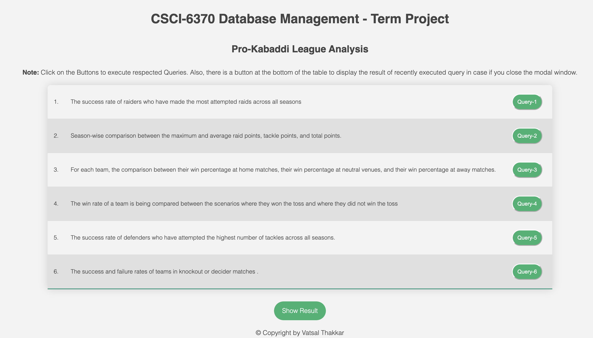
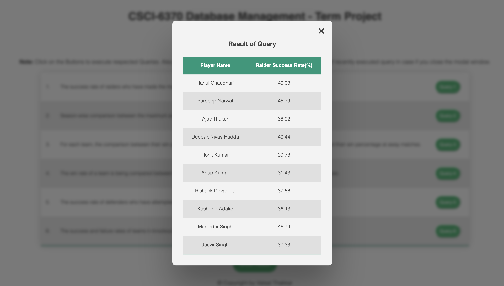
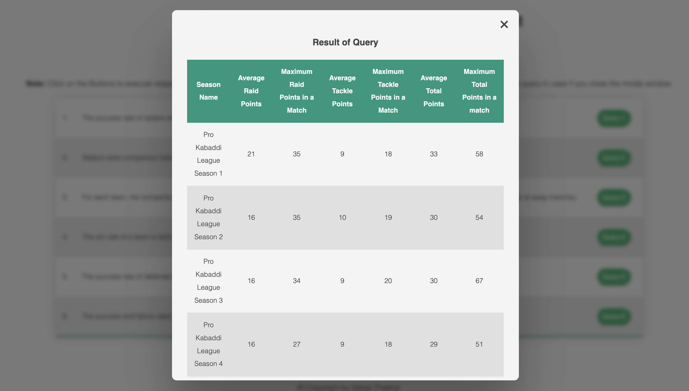
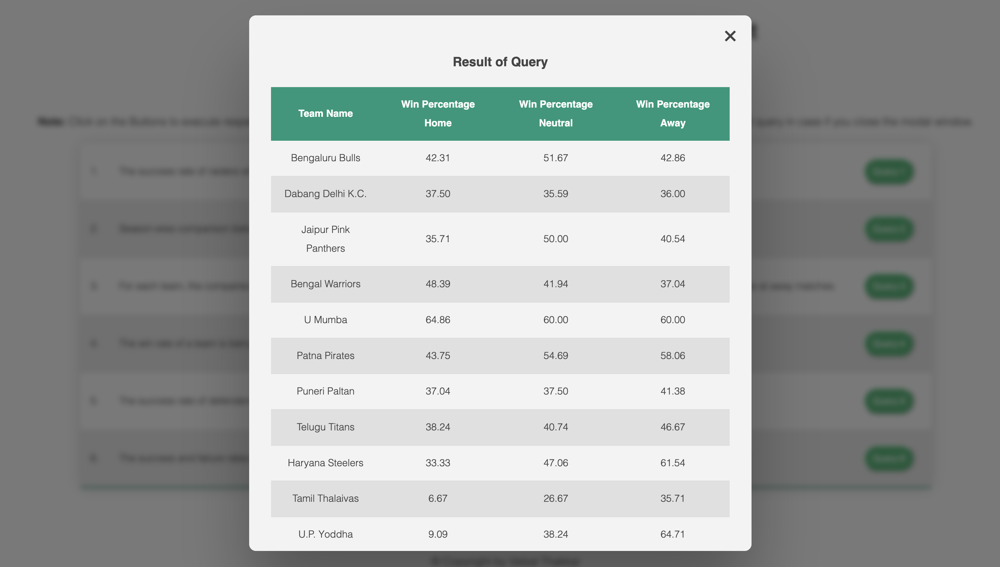
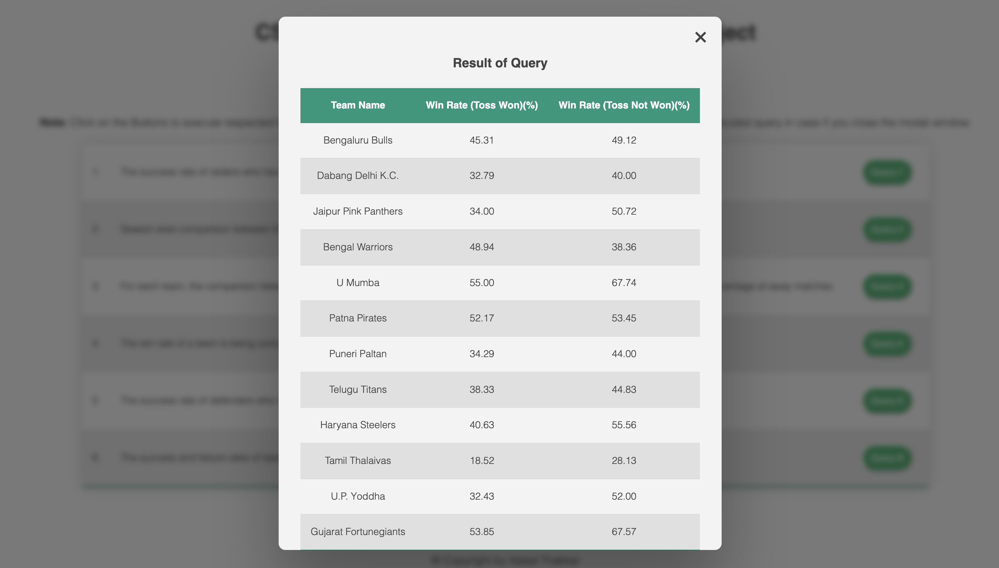
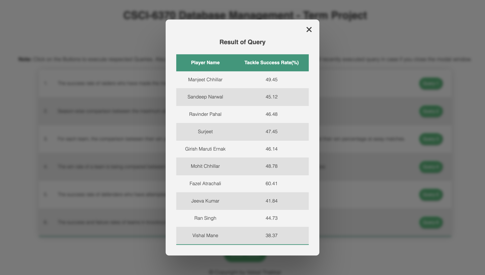
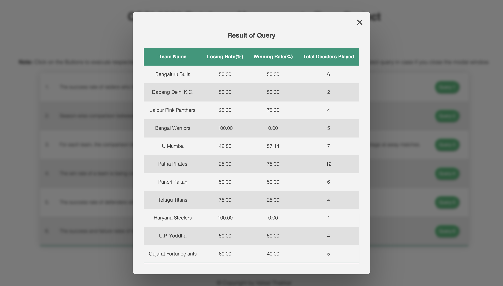

# <b>CSCI 6370 : Database Management - Term Project</b>

#

## <b>How To Run and Compile:</b>
#
NOTE:
Project tested on,

  - MacOS 13.3.1
  - JVM 17.0.6
  - Gradle 7.6
  - Groovy 3.0.13
  - Python 3.10.9
  - MySQL 8.0.31

### **Step - 1 : Install Gradle**
- Install Gradle by following the instructions from <a herf = "https://gradle.org/install/">https://gradle.org/install/</a> (Don't Forget to configure your system environment as mentioned in step-3 of this link.)

### **Step - 2 : Go to Installed Project Directory**
- Now, open your terminal or command prompt and go to the project directory.

  - If you have not set the path for MySQL in your command line :
  - For MAC users:

    ```bash
    export PATH=${PATH}:/usr/local/mysql/bin
    ```

  - For Windows user Click on or Copy this link and paste in your web browser, https://dev.mysql.com/doc/mysql-windows-excerpt/5.7/en/mysql-installation-windows-path.html

### **Step - 3 : Update Environment Variable**
- Update environment variable as per your MySQL credentials. (don't forget to type password of your MySQL root user in <b>`DB_PASS`</b> field because here it is left blank.)

  - Following is for the MAC user.

    ```bash
    export DB_USER=root
    export DB_HOST=localhost
    export DB_PASS=   # Have to write your MySQL root Use Password
    export DB_PORT=3306
    ```

  - For Example,

    ```bash
    export DB_PASS=abc # Don't give space after "="
    ```

  - If You are using Windows or the above thing don't workout for MAC user, you have to type the password of MySQL root user in `DB_PASS` variable in the `DBConnector.java` file (`line number 19`) (`DBConnector.java` file is located in `lib\src\main\ava\project\local`) and also have to write the root user password in `create_database.py` file(`line number 171`)

### **Step-4 : Setup Pro-Kabaddi League (PKL) Database** 
- In this step you will setup the PKL database.
- To set the database you have to just run the `create_database.py` file.
  - `pandas` and `mysql` library of  `Python` should be installed
    ```bash
    pip install pandas mysql
    ```
- On Successful run of the `create_database.py` file you will receive following output.
  ```
  Pro-Kabaddi League Database is created successfully🥳!! (Name of Database is pkl)
  ```
### **Step - 5 : Build Project and Run Web Server** 
- To do that use following command in terminal.

  ```bash
  gradle build && gradle appRun
  ```

### **Step - 6 : Start Client**
- Open site in browser : [WEBSITE LINK](http://localhost:8080/dbms/index.jsp) or copy paste - http://localhost:8080/dbms/index.jsp

#

## Additional things:

- In case a JAVA version issues:

  ```bash
  gradle build -Dorg.gradle.java.home=/JDK_PATH
  ```


#

# Queries

<h3>To Execute the quesries in MySQL: </h3>
<ol>
  <li>
  Open terminal or Command line and open mysql by following line.
  
  ```bash
    mysql -u root -p
  ```
  </li>
  <li>
    Enter Password of your root user
  </li>
  <br/>
  <li>
  Choose database :

```sql
USE pkl;
```

  </li>

<li>

### <b>Query-1:</b> The success rate of raiders who have made the most attempted raids across all seasons

```sql
SELECT player_name AS 'Player Name',
       ROUND(SUM(Player_successful_raids)/SUM(player_total_number_of_raids) * 100, 2) AS 'Raider Success Rate(%)'
FROM player_match_stats
JOIN Player ON player.player_id = player_match_stats.player_id
WHERE player_match_stats.player_id in
    (SELECT player_id
     FROM
       (SELECT player_id,
               SUM(player_total_number_of_raids) AS total_raids
        FROM player_match_stats
        GROUP BY player_id
        ORDER BY Total_raids DESC
        LIMIT 10) AS T)
GROUP BY player_match_stats.player_id ;
```

### <b>Query-2:</b> Season-wise comparison between the maximum and average raid points, tackle points, and total points.

```sql
SELECT season_name AS 'Season Name',
       ROUND(AVG(total_raid_points), 0) AS 'Average Raid Points',
       MAX(total_raid_points) AS 'Maximum Raid Points in a Match',
       ROUND(AVG(total_tackle_points), 0) AS 'Average Tackle Points',
       MAX(total_tackle_points) AS 'Maximum Tackle Points in a Match',
       ROUND(AVG(score), 0) AS 'Average Total Points',
       MAX(score) AS 'Maximum Total Points in a match'
FROM team_match_stats AS TMS
JOIN pkl.match AS M ON TMS.match_id = M.match_id
JOIN season AS S ON M.season_id = S.season_id
GROUP BY M.season_id;
```

### <b>Query-3:</b> For each team, the comparison between their win percentage at home matches, their win percentage at neutral venues, and their win percentage at away matches.

```sql
SELECT team_name AS 'Team Name',
       ROUND(Numeber_of_home_matches_won/Total_home_matches * 100, 2) AS 'Win Percentage Home',
       ROUND(number_of_neutral_matches_won/Total_neutral_matches * 100, 2) 'Win Percentage Neutral',
                                                                           ROUND(Number_of_away_matches_won/Total_away_matches * 100, 2) 'Win Percentage Away'
FROM
  (SELECT team_id,
          COUNT(CASE
                    WHEN team_id = venue_type
                         AND team_id = match_winner_id THEN 1
                END) AS Numeber_of_home_matches_won,
          COUNT(CASE
                    WHEN team_id = venue_type THEN 1
                END) AS Total_home_matches,
          COUNT(CASE
                    WHEN venue_type='Neutral'
                         AND team_id = match_winner_id THEN 1
                END) AS number_of_neutral_matches_won,
          COUNT(CASE
                    WHEN venue_type='Neutral' THEN 1
                END) Total_neutral_matches,
          COUNT(CASE
                    WHEN team_id != venue_type
                         AND venue_type!='Neutral'
                         AND team_id = match_winner_id THEN 1
                END) Number_of_away_matches_won,
          COUNT(CASE
                    WHEN team_id != venue_type
                         AND venue_type!='Neutral' THEN 1
                END) Total_away_matches
   FROM team_match_stats AS TMS3
   JOIN
     (SELECT M.match_id,
             match_winner_id,
             team_1,
             team_2,
             CASE
                 WHEN team_1 = v.team_id THEN team_1
                 WHEN team_2 = v.team_id THEN team_2
                 ELSE 'Neutral'
             END AS venue_type
      FROM pkl.match AS M
      JOIN
        (SELECT TMS.team_id AS team_1,
                TMS2.team_id AS team_2,
                TMS.match_id
         FROM team_match_stats AS TMS
         JOIN
           (SELECT *
            FROM team_match_stats AS T1
            ORDER BY team_id DESC) AS TMS2 ON TMS.match_id = TMS2.match_id
         AND TMS.team_id <> TMS2.team_id
         AND TMS.team_id < TMS2.team_id) AS T ON M.match_id = T.match_id
      JOIN venue AS V ON M.venue_id = V.venue_id) AS T3 ON T3.match_id = TMS3.match_id
   GROUP BY tms3.team_id) AS T4
JOIN team ON T4.team_id = team.team_id;
```

### <b>Query-4:</b> The win rate of a team is being compared between the scenarios when they won the toss and when they did not win the toss

```sql
SELECT team_name AS 'Team Name',
       Round(COUNT(CASE
                       WHEN TMS.team_id = match_winner_id
                            AND TMS.team_id = toss_winner_id THEN 1
                   END) / COUNT(CASE
                                    WHEN TMS.team_id = toss_winner_id THEN 1
                                END)*100, 2) AS 'Win Rate (Toss Won)(%)',
       Round(COUNT(CASE
                       WHEN TMS.team_id = match_winner_id
                            AND TMS.team_id != toss_winner_id THEN 1
                   END) /COUNT(CASE
                                   WHEN TMS.team_id != toss_winner_id THEN 1
                               END) *100, 2) AS 'Win Rate (Toss Not Won)(%)'
FROM team_match_stats AS TMS
JOIN pkl.match AS M ON TMS.match_id = M.match_id
JOIN team AS T ON TMS.team_id = T.team_id
GROUP BY TMS.team_id;
```

### <b>Query-5:</b> The success rate of defenders who have attempted the highest number of tackles across all seasons.

```sql

SELECT player_name AS 'Player Name',
       ROUND(SUM(player_successful_tackles)/SUM(player_total_number_of_tackles) * 100, 2) AS 'Tackle Success Rate(%)'
FROM player_match_stats
JOIN Player ON player.player_id = player_match_stats.player_id
WHERE player_match_stats.player_id in
    (SELECT player_id
     FROM
       (SELECT player_id,
               SUM(player_total_number_of_tackles) AS total_tackles
        FROM player_match_stats
        GROUP BY player_id
        ORDER BY total_tackles DESC
        LIMIT 10) AS T)
GROUP BY player_match_stats.player_id ;
```

### <b>Query-6:</b> The success and failure rates of teams in knockout or decider matches.

```sql

SELECT team_name AS 'Team Name',
       ROUND(matches_lost/matches_played*100, 2) 'Losing Rate(%)',
                                                 ROUND(matches_won/matches_played*100, 2) 'Winning Rate(%)',
                                                                                          matches_played AS 'Total Deciders Played'
FROM
  (SELECT team_id,
          COUNT(CASE
                    WHEN team_id != match_winner_id THEN 1
                END) matches_lost,
          COUNT(CASE
                    WHEN team_id= match_winner_id THEN 1
                END) matches_won,
          COUNT(team_id) matches_played
   FROM pkl.match AS M
   JOIN team_match_stats AS TMS ON M.match_id = TMS.match_id
   WHERE match_number NOT LIKE 'MATCH%'
   GROUP BY team_id) AS T1
JOIN team ON T1.team_id = team.team_id;
```

</li>

</ol>

#

# Images of Web Application:

### <b>Home Page:</b>

<br/>

### <b>Result of Query - 1:</b>

<br/>

### <b>Result of Query - 2:</b>

<br/>

### <b>Result of Query - 3:</b>

<br/>

### <b>Result of Query - 4:</b>

<br/>

### <b>Result of Query - 5:</b>

<br/>

### <b>Result of Query - 6:</b>

<br/>

## <b>Author:</b>

- <h3><b>Vatsal Thakkar</b></h3>
